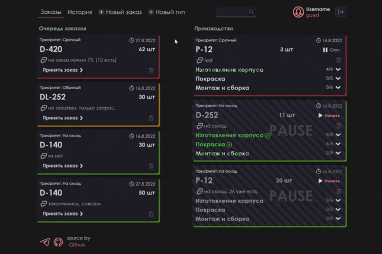
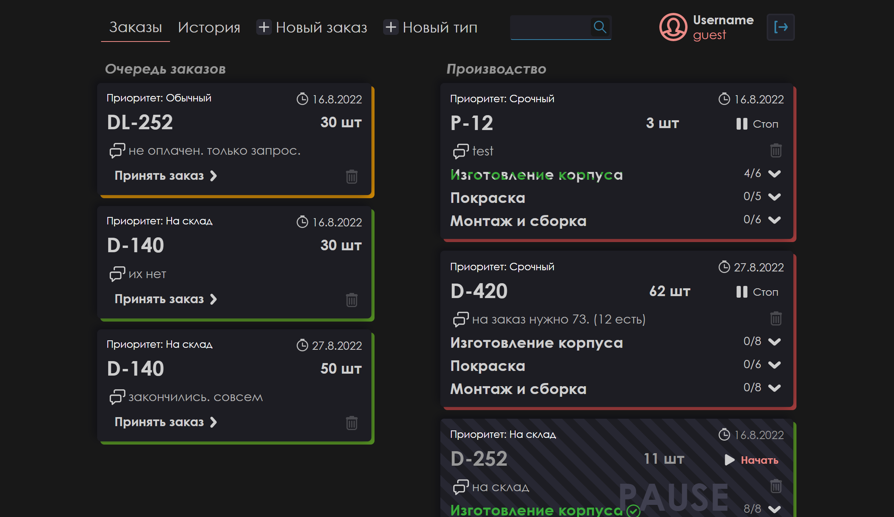
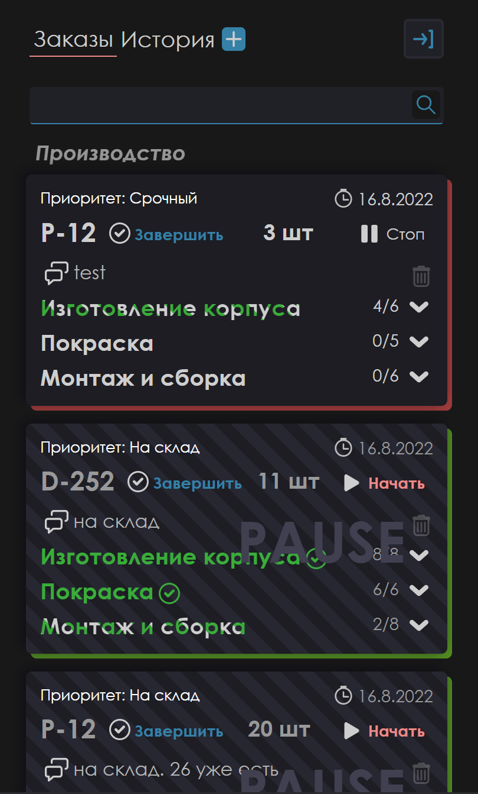
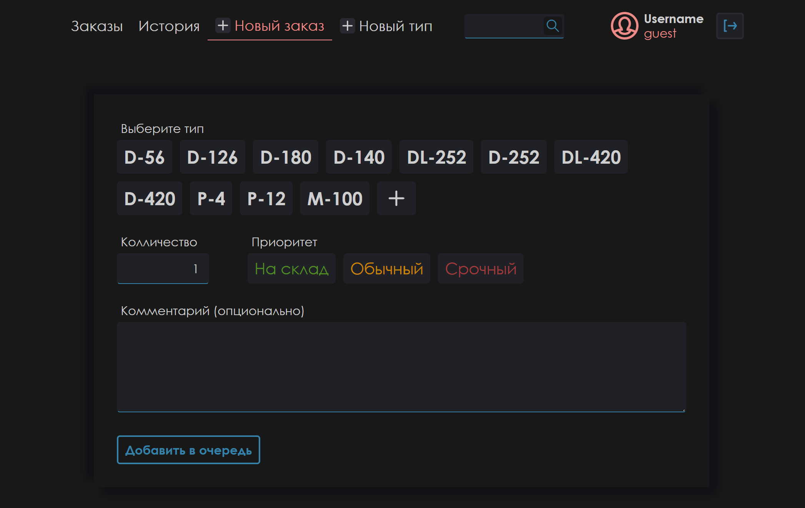
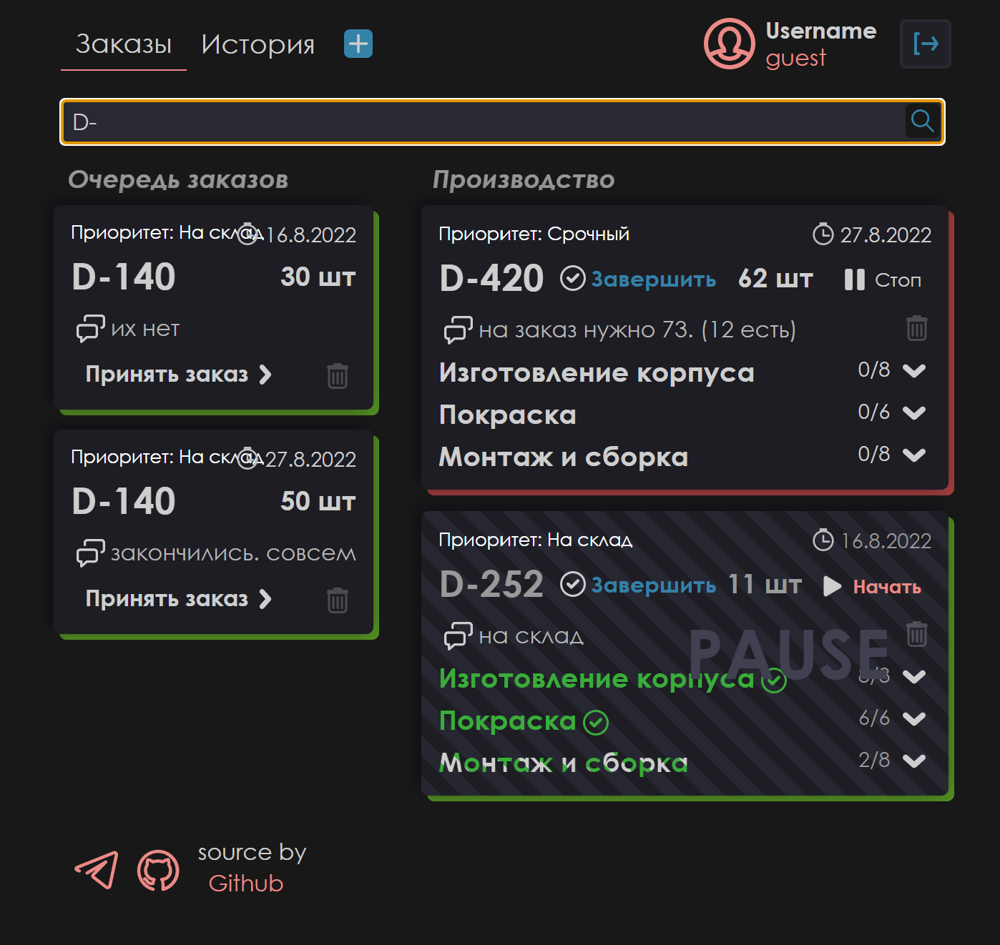
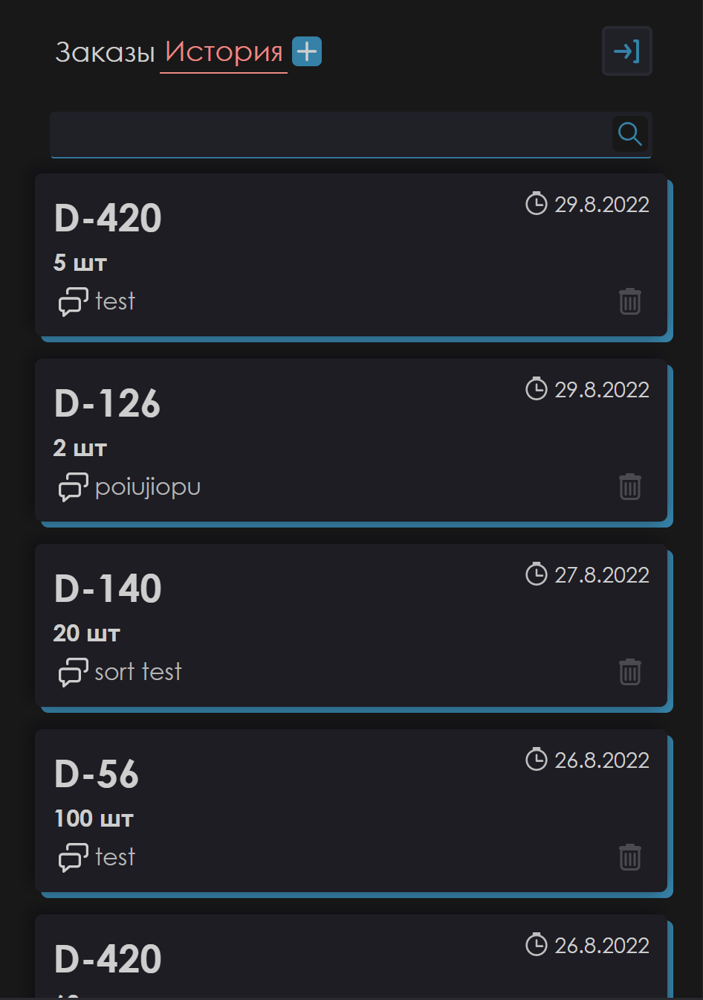
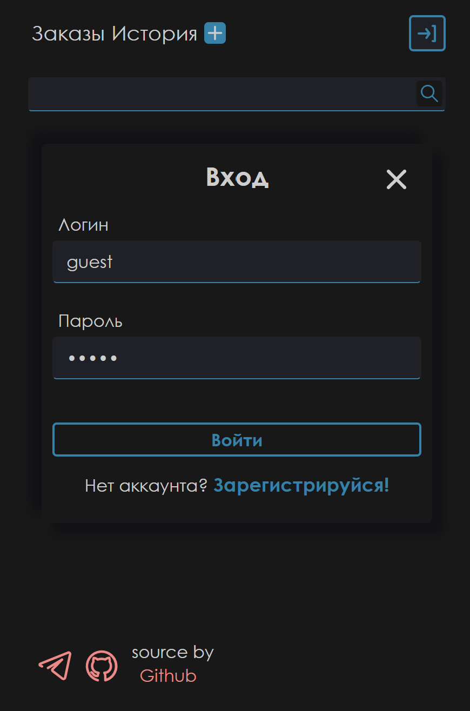

# lamp-orders

Это сервис для размещения заказов для прозводства инфракрасных прожекторов.
А также для контроля этапов их производства.

## [<a href="https://lamp-orders.vercel.app/"> **Демонстрация** </a>]

Сервис можно посмотреть тут ->><a href="https://lamp-orders.vercel.app/"> **Демонстрация** </a>  
Для теста функционала используйте:  
login: **Guest**  
password: **guest**

## Что **использовалось**

Основа: **Typescript**, **React**, **Create-react-app** 
State-manager: **Redux**, **Redux-Toolkit**, **RTK Query** 
Маршрутизация: **React-Router** 
Стилизация: **Scss** 
 
<a href="https://github.com/knyazev13ivan/lamp-orders-server">**backend**</a>: **MongoBD**, **Express** 
Аутентификация: **bcrypt**, **jsonwebtoken**  
При разработке пользовался: **Insomnia**, **MongoBDCompass**

### Контакты: <a href="https://t.me/hauntar">**telegram**</a>

## Демонстрация экранов

